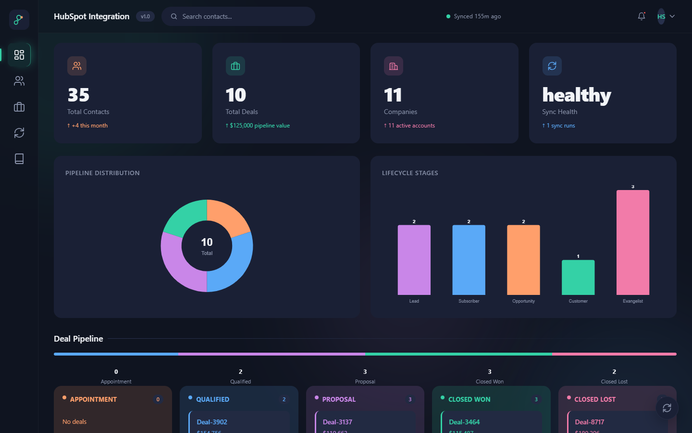
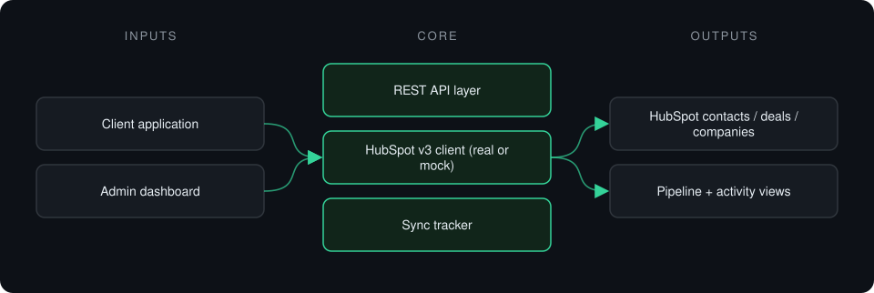
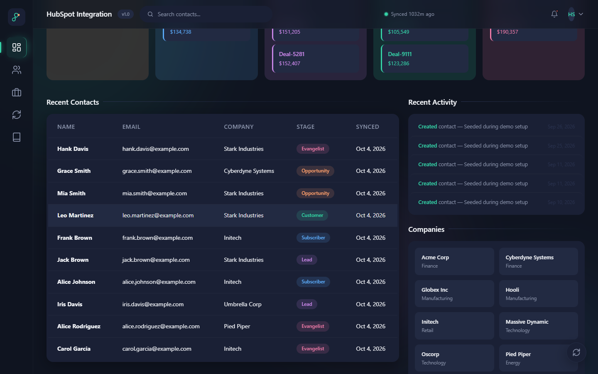

# HubSpot API Integration

**Direct HubSpot CRM integration (contacts, deals, companies) for clients who have outgrown Zapier or Make.**

> **This is a proprietary project. Source code is private. This page showcases the system's architecture and results.**

**Case study page:** [https://jryahia.github.io/showcase-hubspot-api-integration/](https://jryahia.github.io/showcase-hubspot-api-integration/)

## Problem it solves

No-code connectors hit limits on volume, logic and error handling. This service talks to the HubSpot CRM API v3 directly and gives the client app full CRUD with its own dashboard.

## Architecture

1. The client app calls the integration's REST endpoints.
2. Requests go to HubSpot CRM API v3, or to a mock in demo mode.
3. Results are tracked for sync health.
4. The dashboard shows contacts, the deal pipeline and activity.

## Key features

- Contacts, deals and companies CRUD
- Kanban deal pipeline view
- Mock mode with realistic HubSpot-shaped data
- Validated configuration with safe fallbacks
- Sync statistics

## Tech stack

    

## What it does in practice

- Replaces a chain of no-code zaps with one maintainable service.

## Screenshots

**Contacts, pipeline and sync health**

**Contacts, activity and companies**

---

Built by [Yahya Jarray](https://github.com/jryahia). Interested in a similar system? [Get in touch](mailto:yahiajarray43@gmail.com).

This repository contains no source code. It is a case study for a proprietary project. © Yahya Jarray.
